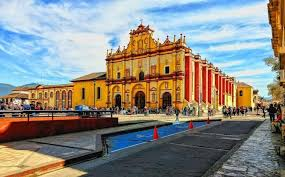
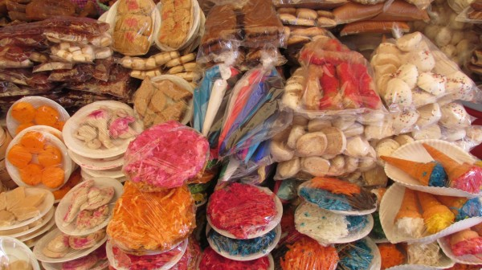
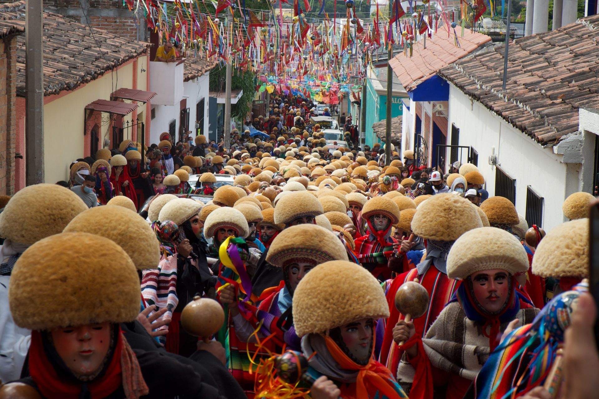

# Practica-4
Tablas con imagenes insertadas en lenguaje HTML

<doctype html>
<html lang="en">
  <meta charset="UTF-8">
    <meta http-equiv="X-UA-Compatible" content="IE=edge">
    <meta name="viewport" content="width=device-width, initial-scale=1.0">
    <title>pagina2.html</title>
</head>

<body background="fondo12.jpg" bgcolor="#666069"> 
    
    <H1>LOS MEJORES LUGARES PARA TURISMO EN CHIAPAS</H1>
    

     
     
    <Table>
        <TR>
            <TD>Lugares Turisticos de chiapas</TD>
            
                <TD><ul>
                <LI>SAN CRISTOBAL</LI>
                <LI>CHIAPA DE CORZO</LI>
                <LI>TUXTLA GUTIÉRREZ</LI>
                <LI>BERRIOZABAL</LI>
                <LI>PALENQUE</LI>
                <LI>TsAPACHULA</LI>
                <LI>COMITAN</LI>
                
            </ul></TD>
            <td>
                </td>
        </TR>
        <tr>
            <TD>Dulces tipicos de Chiapas</TD>
            <TD><ol>
                <li>NUEGADO</li>
                <LI>CHIMBO</LI>
                <li>COCADAS</li>
                <LI>JOCOTE Y NANCE CURTIDO</LI>
                <LI>MELCOCHA</LI>
                <LI>TURRONES</LI>
                
            </ol>
            </TD>
            <td></td>
        </TR>
        <TR>
            <TD>Fiestas Tradicionales de Chiapas</TD>
            <TD><d1>
                <dt>CHIAPA DE CORZO</dt>
                <DD><h6>Fiesta de San Sebastián y feria popular. Se festeja con danzas de Parachicos, desfile de carros alegóricos y un “combate naval"</h6></DD>
                <dt>PALENQUE</dt>
                <DD><h6>Fiesta de Santo Domingo de Guzmán. Feria popular y fuegos artificiales</h6></DD>
                <dt>COMITÁN DE DOMÍNGUEZ</dt>
                <dd><H6>Se festeja a San Caralampio, con danzas de Demonios y feria. Noviembre 1 y 2. Celebración de muertos, con ofrendas y música.</h6></dd>
                <DT>TUXTLA GUTIÉRREZ</DT>
                <DD><h6>Fiesta de San Marcos, que dura cinco días con feria, procesiones y fuegos artificiales</h6></DD>
                </d1>
                
            </TD>
            <td></td>
        </TR>
        </Table>
     
     
     
    

    

<h6></h6> @2022 Gerardo Mauricio

</body>
</html>
        
